## A native Android mobile app which allows to log blood pressure measurements

 - saving and browsing measurements
 - narrowing measurements list using date and time filters
 - import measurements to PDF and/or spreadseet file
 - night mode (based on a device/permanent light or dark)

|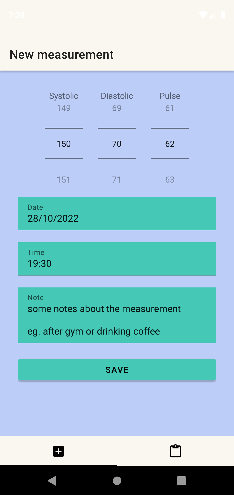|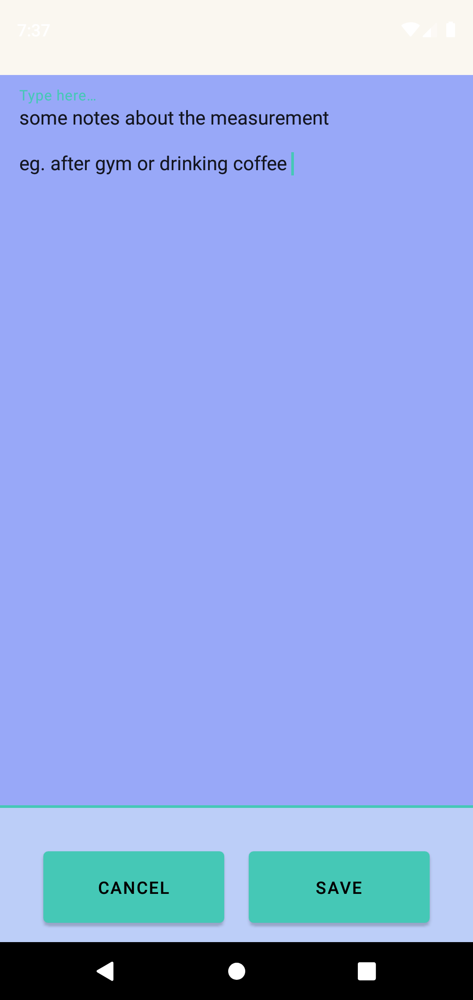|
|--|--|

|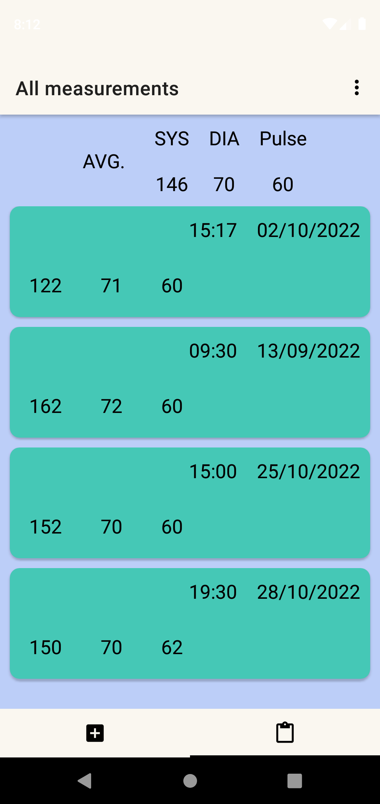|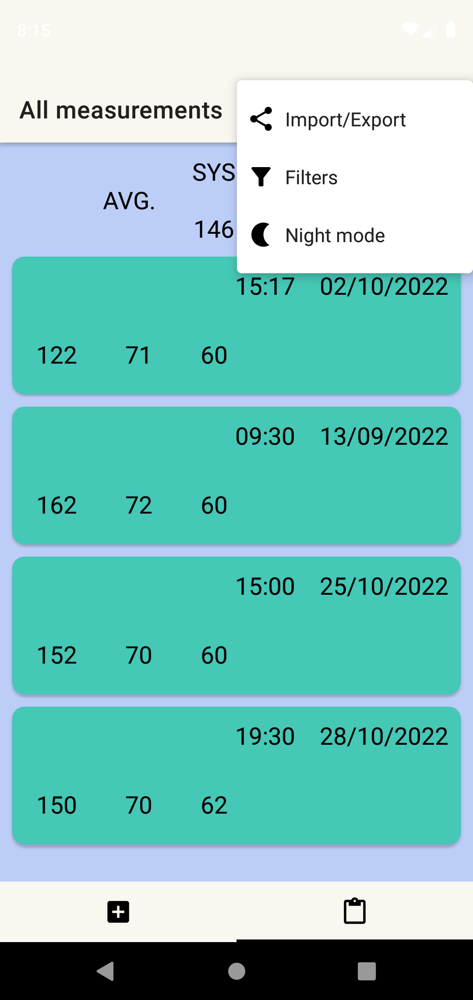|
|--|--|

|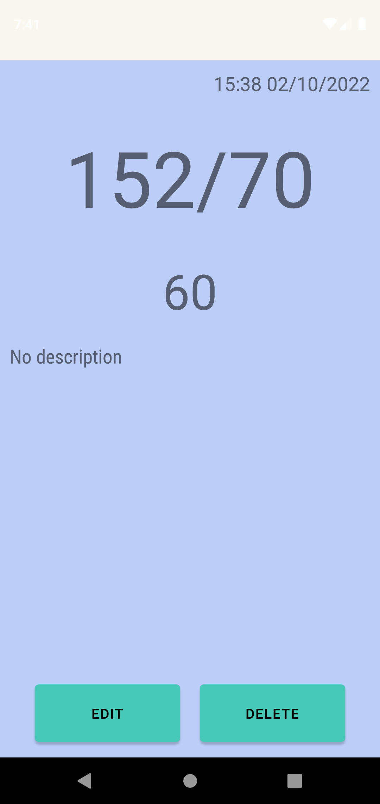|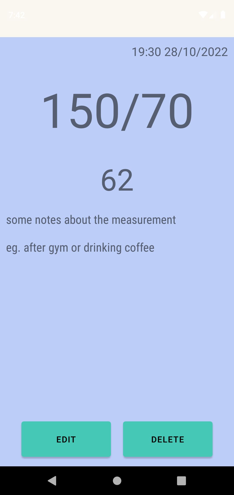|
|--|--|

|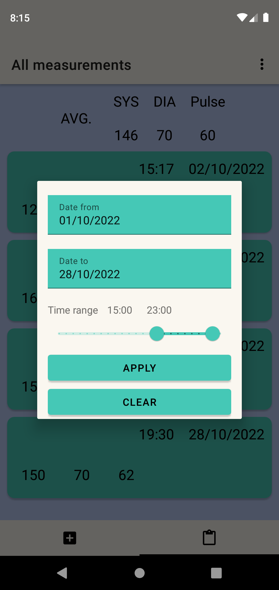|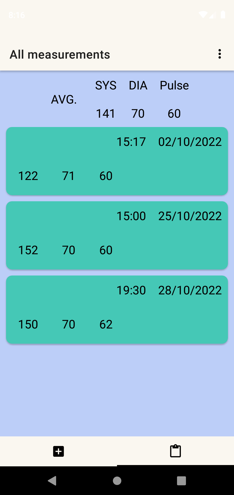|
|--|--|

|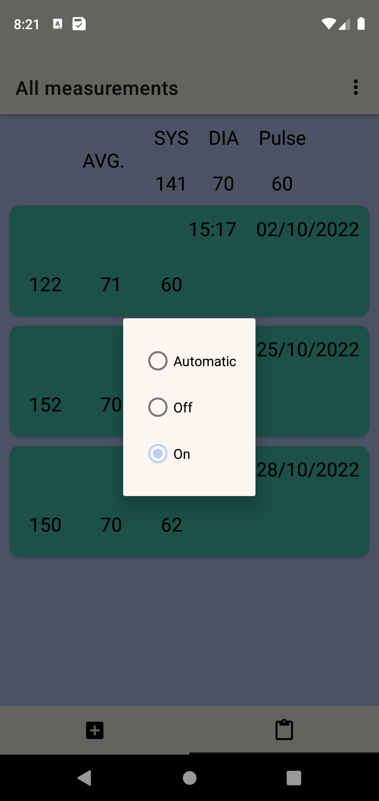|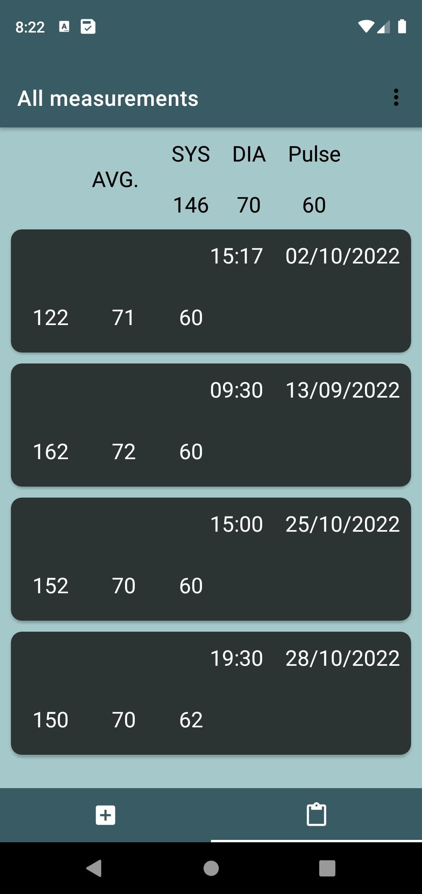|
|--|--|

|
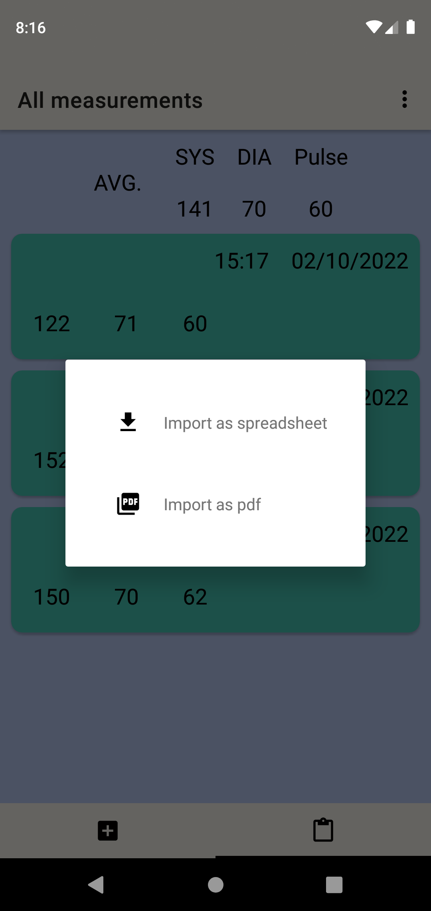
|
|--|

|
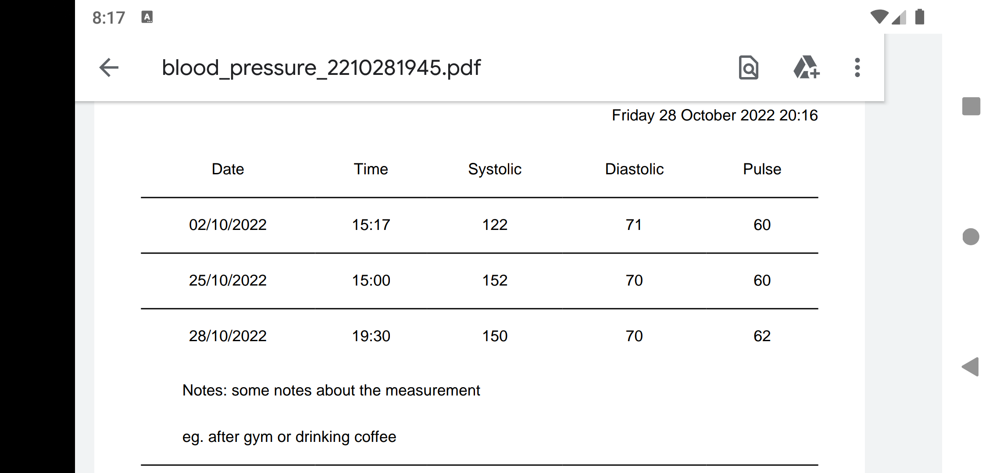
|
|--|

|
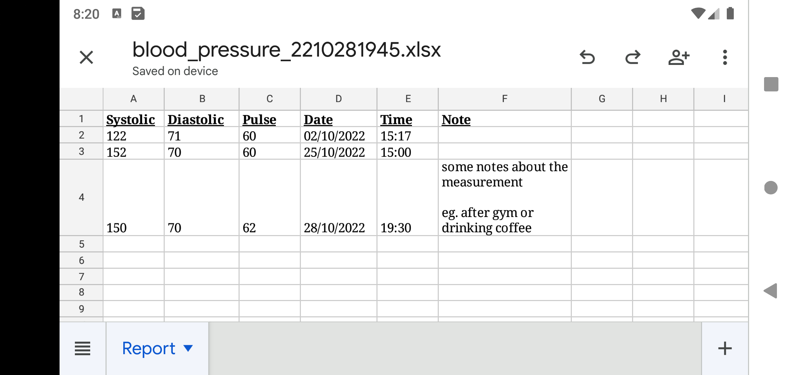
|
|--|